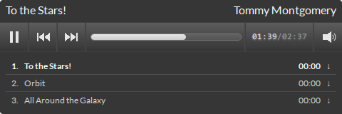

# Rach3

This is a little experiment at using the Web Audio API
to write a homegrown HTML audio player. Because why not?

Works in anything that supports `ArrayBuffer`, `<audio>`
and the Web Audio API. Which is Firefox and most versions
of Webkit.

It's named after
[Rachmaninoff's greatest piano concerto](http://www.youtube.com/watch?v=lusMu2LGIUM).
Some people think the C Minor concerto is the greatest, but those
people don't know about [the saddest key](http://en.wikipedia.org/wiki/D_minor).
